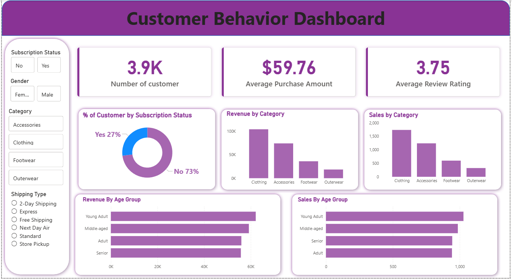

# 🛍️ Customer Shopping Behavior Analysis

> **"How can a company leverage consumer shopping data to identify trends,
> improve customer engagement, and optimize marketing and product strategies?"**

A complete end-to-end data analytics project analyzing **3,900 retail transactions**
to uncover what drives customer purchases, loyalty, and revenue.

---

## 📌 Project Overview

A leading retail company noticed shifts in purchasing patterns across demographics,
product categories, and sales channels. This project digs into that data to answer
10 real business questions — from revenue by gender to customer segmentation and
discount behavior — and delivers actionable recommendations for the business.

---

## 📂 Dataset

| Attribute | Detail |
|---|---|
| Source | Customer Shopping Behavior Dataset |
| Rows | 3,900 transactions |
| Columns | 18 features |
| Demographics | Age, Gender, Location, Subscription Status |
| Purchase Info | Item, Category, Amount (USD), Season, Size, Color |
| Behavior | Discount Applied, Previous Purchases, Review Rating, Shipping Type |
| Missing Data | 37 null values in `review_rating` → imputed using category median |

---

## 🛠️ Tools & Technologies

| Phase | Tool |
|---|---|
| Data Cleaning & EDA | Python (pandas) |
| Database & SQL Analysis | MySQL |
| Visualization | Power BI |
| Report | Microsoft Word / PDF |
| Presentation | Gamma (AI-powered PPT) |

---

## 🔄 Project Workflow
```
Raw Dataset → Python (EDA + Cleaning) → MySQL (SQL Queries) → Power BI Dashboard → Report & PPT
```

### Step 1 — Data Preparation (Python)
- Loaded dataset with `pandas` and explored using `.info()` and `.describe()`
- Imputed 37 missing `review_rating` values using **per-category median**
- Renamed columns to `small_case` for SQL compatibility
- Engineered new columns: `age_group` and `purchase_frequency_days`
- Dropped `promo_code_used` (redundant with `discount_applied`)
- Connected Python to **MySQL** and loaded the cleaned DataFrame

### Step 2 — SQL Analysis (MySQL)
10 business queries executed to extract insights:

| # | Business Question |
|---|---|
| Q1 | Revenue by Gender |
| Q2 | High-Spending Discount Users |
| Q3 | Top 5 Products by Average Review Rating |
| Q4 | Shipping Type Comparison (Standard vs Express) |
| Q5 | Subscribers vs. Non-Subscribers spend comparison |
| Q6 | Most Discount-Dependent Products |
| Q7 | Customer Segmentation (New / Returning / Loyal) |
| Q8 | Top 3 Products per Category |
| Q9 | Repeat Buyers & Subscription likelihood |
| Q10 | Revenue Contribution by Age Group |

### Step 3 — Power BI Dashboard
Built an interactive dashboard with slicers for Gender, Category, Subscription
Status, and Shipping Type.

### Step 4 — Report & Presentation
- Written report documenting methodology, results, and recommendations
- Presentation built using **Gamma** for stakeholder storytelling

---

## 📊 Dashboard Preview


**Key KPIs shown:**
- 3.9K Total Customers
- $59.76 Average Purchase Amount
- 3.75 Average Review Rating

---

## 📈 Key Results

| Finding | Insight |
|---|---|
| 💰 Revenue by Gender | Male customers generated 2x more revenue ($157,890 vs $75,191) |
| 🏷️ Discount Users | 839 customers used discounts yet still spent above average |
| ⭐ Top Rated Products | Gloves (3.86), Sandals (3.84), Boots (3.82) |
| 🚚 Shipping Preference | Express users spend slightly more ($60.48 vs $58.46) |
| 📦 Loyal Customers | 3,116 out of 3,900 customers are classified as Loyal (79.9%) |
| 🔔 Subscription Gap | Only 27% of customers subscribed despite high loyalty |
| 👶 Top Revenue Age Group | Young Adults contribute the most revenue ($62,143) |

---

## 💡 Business Recommendations

- **Boost Subscriptions** — Target repeat buyers with exclusive perks (early access, free shipping)
- **Grow Female Segment** — Develop female-focused campaigns and curated product lines
- **Fix Discount Policy** — Hat, Sneakers & Coat have ~50% discount rates; switch to value-adds
- **Promote Top-Rated Products** — Feature Gloves, Sandals, Boots in homepage and email campaigns
- **Acquire New Customers** — Only 83 new customers found; invest in referral & social campaigns
---


## 🗂️ Repository Structure
```
📁 customer-shopping-behavior-analysis/
│
├── 📁 dataset/
│   └── customer_shopping_data.csv
│
├── 📁 python/
│   └── data_cleaning_eda.ipynb
│
├── 📁 sql/
│   └── cutomer_analysis.sql
│
├── 📁 powerbi/
│   └── customer_behavior_dashboard.pbix
│
├── 📁 report/
│   └── Customer_Shopping_Behavior_Report.pdf
│
├── 📁 presentation/
│   └── Customer_Shopping_Behavior_PPT.pdf
│
└── README.md
```

---
## ▶️ How to Run

**1. Clone the repository**
```bash
git clone https://github.com/your-username/customer-shopping-behavior-analysis.git
```

**2. Run the Python notebook**
```bash
cd python
jupyter notebook data_cleaning_eda.ipynb
```

**3. Set up MySQL and run SQL queries**
```bash
# Import the cleaned CSV into MySQL, then run:
mysql -u root -p < sql/business_queries.sql
```

**4. Open Power BI Dashboard**
- Open `powerbi/customer_behavior_dashboard.pbix` in Power BI Desktop

---

## 👤 Author

**Aniket Kanojiya**  
📧 akanojiya146@gmail.com 
🔗 [LinkedIn Profile](https://www.linkedin.com/in/aniket-k-a58991368/?skipRedirect=true)  
💻 [GitHub](https://github.com/Aniket-Kanojiya)

---

*This project was built as part of a data analytics case study to demonstrate
end-to-end skills in Python, SQL, and Business Intelligence.*
